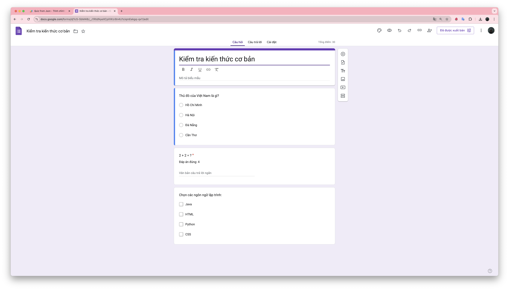

# Biến Google Forms thành cỗ máy tạo Quiz tự động với JSON và Apps Script

Hello anh em, Blog này mình sẽ chia sẻ một bí mật nho nhỏ nhưng cực kỳ hữu ích: cách biến Google Forms thành một cỗ máy tạo quiz tự động chỉ với vài dòng code Google Apps Script và một file JSON đơn giản. Nghe có vẻ phức tạp? Đừng lo, mình sẽ hướng dẫn ae từng bước một, đảm bảo ai cũng có thể làm được, kể cả khi ae mới làm quen với Apps Script.

## **Tại sao ae nên quan tâm đến việc này?**

Chuyện là đi dạy thỉnh thoảng phải xào Quiz Test trên Google Forms cho các lớp để anh em ôn lại kiến thức khá tốn thời gian với chán nên 1 ng anh đã suggest cho mình dùng code với AI xem thì mình có đi research ra cách này khá là okela, ace nào hay phải tạo form Quiz ứng dụng luôn cho nóng nhé. 

Với phương pháp này, ae có thể:
*   **Tiết kiệm thời gian:** Tạo hàng trăm câu hỏi chỉ trong vài phút thay vì hàng giờ.
*   **Quản lý dễ dàng:** Lưu trữ và chỉnh sửa câu hỏi một cách tập trung trong file JSON.
*   **Tự động hóa quy trình:** Dễ dàng tạo các bài quiz định kỳ hoặc các bài test có cấu trúc phức tạp.
*   **Nâng cao hiệu suất:** Tập trung vào nội dung quan trọng thay vì tốn thời gian cho các thao tác lặp đi lặp lại.

## **Vậy Google Apps Script là gì?**

Google Apps Script là một ngôn ngữ lập trình dựa trên JavaScript, cho phép ae tự động hóa và mở rộng các ứng dụng của Google Workspace (Docs, Sheets, Forms, v.v.). Nó giống như một "siêu năng lực" giúp ae làm việc hiệu quả hơn với các công cụ quen thuộc của Google.

## **Những gì ae cần để bắt đầu:**

*   Một tài khoản Google (chắc chắn rồi!).
*   Kiến thức cơ bản về JavaScript (không cần quá chuyên sâu, mình sẽ giải thích mọi thứ).
*   Một chút tò mò và tinh thần học hỏi.

### **Bước 1: Xây dựng "ngôi nhà" JSON cho dữ liệu quiz**

JSON (JavaScript Object Notation) là một định dạng dữ liệu nhẹ, dễ đọc và dễ chỉnh sửa. Chúng ta sẽ sử dụng JSON để "mô tả" các câu hỏi và đáp án của quiz. Hãy tưởng tượng JSON như một "ngôi nhà" lưu trữ thông tin một cách có cấu trúc.

Đây là ví dụ về cấu trúc JSON mà chúng ta sẽ sử dụng:

```json
{
  "quizTitle": "Kiểm tra kiến thức cơ bản",
  "questions": [
    {
      "question": "Thủ đô của Việt Nam là gì?",
      "type": "multipleChoice",
      "point": 10,
      "options": [
        { "content": "Hồ Chí Minh", "isCorrect": false },
        { "content": "Hà Nội", "isCorrect": true },
        { "content": "Đà Nẵng", "isCorrect": false },
        { "content": "Cần Thơ", "isCorrect": false }
      ]
    },
    {
      "question": "2 + 2 = ?",
      "type": "shortAnswer",
      "point": 5,
      "correctAnswer": "4"
    },
    {
      "question": "Chọn các ngôn ngữ lập trình:",
      "type": "checkbox",
      "point": 15,
      "options": [
        { "content": "Java", "isCorrect": true },
        { "content": "HTML", "isCorrect": false },
        { "content": "Python", "isCorrect": true },
        { "content": "CSS", "isCorrect": false }
      ]
    }
  ]
}
```

**Giải thích cấu trúc JSON:**

*   `quizTitle`: Tiêu đề của bài quiz (ví dụ: "Kiểm tra kiến thức cơ bản").
*   `questions`: Một mảng chứa các đối tượng câu hỏi.
*   **Mỗi đối tượng câu hỏi có các thuộc tính sau:**
    *   `question`: Nội dung câu hỏi (ví dụ: "Thủ đô của Việt Nam là gì?").
    *   `type`: Loại câu hỏi (ví dụ: `multipleChoice`, `shortAnswer`, `checkbox`).
    *   `point`: Số điểm cho câu hỏi này.
    *   `options`: (Chỉ dành cho câu hỏi trắc nghiệm) Một mảng các đối tượng lựa chọn.
        *   `content`: Nội dung của lựa chọn (ví dụ: "Hà Nội").
        *   `isCorrect`: `true` nếu lựa chọn này là đáp án đúng, `false` nếu không.
    *   `correctAnswer`: (Chỉ dành cho câu hỏi tự luận) Đáp án đúng (ví dụ: "4").

**Các loại câu hỏi được hỗ trợ:**

*   `multipleChoice`: Câu hỏi trắc nghiệm một đáp án (chỉ một lựa chọn đúng).
*   `shortAnswer`: Câu hỏi trả lời ngắn (ví dụ: điền vào chỗ trống).
*   `checkbox`: Câu hỏi trắc nghiệm nhiều đáp án (có thể chọn nhiều lựa chọn đúng).

### **Bước 2: Viết code Apps Script và tạo quiz**

1.  **Tạo Google Form mới:** Truy cập [https://forms.google.com](https://forms.google.com) và tạo một form mới.
2.  **Mở Apps Script:** Trong form, nhấp vào biểu tượng dấu ba chấm (⋮) ở góc trên bên phải, chọn "Apps Script".
3.  **Sao chép và dán code:** Sao chép đoạn code sau và dán vào Apps Script:

```javascript
function createQuizFromJSON() {
  // Dữ liệu JSON (thay thế bằng dữ liệu thực tế của ae)
  const jsonData = {
    "quizTitle": "Kiểm tra kiến thức cơ bản",
    "questions": [
      {
        "question": "Thủ đô của Việt Nam là gì?",
        "type": "multipleChoice",
        "point": 10,
        "options": [
          { "content": "Hồ Chí Minh", "isCorrect": false },
          { "content": "Hà Nội", "isCorrect": true },
          { "content": "Đà Nẵng", "isCorrect": false },
          { "content": "Cần Thơ", "isCorrect": false }
        ]
      },
      {
        "question": "2 + 2 = ?",
        "type": "shortAnswer",
        "point": 5,
        "correctAnswer": "4"
      },
      {
        "question": "Chọn các ngôn ngữ lập trình:",
        "type": "checkbox",
        "point": 15,
        "options": [
          { "content": "Java", "isCorrect": true },
          { "content": "HTML", "isCorrect": false },
          { "content": "Python", "isCorrect": true },
          { "content": "CSS", "isCorrect": false }
        ]
      }
    ]
  };

  // Tạo một Google Form mới và bật chế độ Quiz
  const form = FormApp.create(jsonData.quizTitle);
  form.setIsQuiz(true);

  // Duyệt qua từng câu hỏi trong JSON
  jsonData.questions.forEach(questionData => {
    let question;

    if (questionData.type === 'multipleChoice') {
      // Tạo câu hỏi trắc nghiệm một đáp án
      question = form.addMultipleChoiceItem();
      question.setTitle(questionData.question);
      question.setChoices(
        questionData.options.map(option => question.createChoice(option.content, option.isCorrect))
      );
      question.setPoints(questionData.point);

      // Thêm feedback
      const correctFeedback = FormApp.createFeedback().setText("Chính xác!").build();
      const incorrectFeedback = FormApp.createFeedback().setText("Chưa đúng!").build();
      question.setFeedbackForCorrect(correctFeedback);
      question.setFeedbackForIncorrect(incorrectFeedback);
    } else if (questionData.type === 'shortAnswer') {
      // Tạo câu hỏi trả lời ngắn
      question = form.addTextItem();
      question.setTitle(questionData.question);
      question.setPoints(questionData.point);
      question.setRequired(true);
      question.setHelpText(`Đáp án đúng: ${questionData.correctAnswer}`); // Gợi ý đáp án
    } else if (questionData.type === 'checkbox') {
      // Tạo câu hỏi trắc nghiệm nhiều đáp án
      question = form.addCheckboxItem();
      question.setTitle(questionData.question);
      question.setChoices(
        questionData.options.map(option => question.createChoice(option.content, option.isCorrect))
      );
      question.setPoints(questionData.point);

      // Thêm feedback
      const correctFeedback = FormApp.createFeedback().setText("Chính xác!").build();
      const incorrectFeedback = FormApp.createFeedback().setText("Chưa đúng!").build();
      question.setFeedbackForCorrect(correctFeedback);
      question.setFeedbackForIncorrect(incorrectFeedback);
    }
  });

  // In URL của form đã tạo ra
  Logger.log('Form URL: ' + form.getPublishedUrl());
}
```

4.  **Giải thích code (ae đọc code trên hiểu rồi có thể bỏ qua phần này):**

*   `function createQuizFromJSON() { ... }`: Đây là hàm chính của chúng ta, nơi mọi thứ diễn ra.
*   `const jsonData = { ... };`:  Khai báo một biến `jsonData` chứa dữ liệu JSON của bài quiz. **Lưu ý:** ae cần thay thế dữ liệu này bằng dữ liệu JSON thực tế của ae.
*   `FormApp.create(jsonData.quizTitle);`: Tạo một Google Form mới với tiêu đề được lấy từ `jsonData.quizTitle`.
*   `form.setIsQuiz(true);`: Bật chế độ "Quiz" cho form, cho phép ae gán điểm và đánh giá câu trả lời.
*   `jsonData.questions.forEach(questionData => { ... });`:  Duyệt qua từng câu hỏi trong mảng `jsonData.questions`.
*   `if (questionData.type === 'multipleChoice') { ... }`: Kiểm tra loại câu hỏi và tạo câu hỏi tương ứng.
    *   `form.addMultipleChoiceItem();`: Tạo một câu hỏi trắc nghiệm một đáp án.
    *   `question.setTitle(questionData.question);`: Thiết lập tiêu đề của câu hỏi.
    *   `question.setChoices( ... );`:  Thiết lập các lựa chọn cho câu hỏi, dựa trên mảng `questionData.options`.  `question.createChoice(option.content, option.isCorrect)` tạo một lựa chọn mới với nội dung và trạng thái đúng/sai.
    *   `question.setPoints(questionData.point);`: Gán điểm cho câu hỏi.
    *   `FormApp.createFeedback().setText("Chính xác!").build();`: Tạo feedback cho câu trả lời đúng.
    *   `question.setFeedbackForCorrect(correctFeedback);`: Gán feedback cho câu trả lời đúng.
    *   Tương tự cho `incorrectFeedback` và `setFeedbackForIncorrect`.
*   `else if (questionData.type === 'shortAnswer') { ... }`: Tạo câu hỏi trả lời ngắn.
    *   `form.addTextItem();`: Tạo một câu hỏi trả lời ngắn.
    *   `question.setHelpText(`Đáp án đúng: ${questionData.correctAnswer}`);`: Thêm gợi ý về đáp án đúng.
*   `else if (questionData.type === 'checkbox') { ... }`: Tạo câu hỏi trắc nghiệm nhiều đáp án (tương tự như `multipleChoice`).
*   `Logger.log('Form URL: ' + form.getPublishedUrl());`:  In URL của form đã tạo ra vào log, để ae có thể dễ dàng truy cập.

5.  **Chạy script:** Trên thanh công cụ của Apps Script, nhấp vào biểu tượng "Run" (chạy).  ae sẽ được yêu cầu cấp quyền cho script truy cập vào Google Forms của ae.

###  **Bước 3: Kiểm tra kết quả và tận hưởng thành quả!**

- Sau khi script chạy xong, hãy kiểm tra log (View -> Logs) để tìm URL của form mới được tạo hoặc vào GG Form check. 
- Truy cập URL đó và ae sẽ thấy một bài quiz hoàn chỉnh với tất cả các câu hỏi và đáp án đã được tạo tự động từ file JSON của ae. Amazing phải không?


## **Sử dụng AI để tạo câu hỏi JSON**

Ae đã biết cách tạo quiz từ dữ liệu JSON, nhưng làm sao để có được dữ liệu JSON đó một cách nhanh chóng và hiệu quả hơn nữa? Câu trả lời là: ứng dụng sức mạnh của AI!

- Quy trình sử dụng AI để tạo câu hỏi JSON:

    - Chọn công cụ AI phù hợp: Lựa chọn công cụ AI phù hợp với nhu cầu và túi tiền của ae. (Chat GPT, Gemini, Claude.ai, ...)

    - Nhập thông tin và yêu cầu vào AI: Cung cấp thông tin và yêu cầu chi tiết cho công cụ AI. Ví dụ, ae có thể nhập một đoạn văn bản và yêu cầu AI tạo ra các câu hỏi trắc nghiệm dựa trên nội dung của đoạn văn bản đó hoặc có bộ câu hỏi rồi thì đưa cho nó thôi.

    - Đánh giá và chỉnh sửa câu hỏi: Sau khi AI tạo ra các câu hỏi, hãy dành thời gian để review và edit lại cho đúng ý.

    - Chuyển đổi sang định dạng JSON: Chuyển đổi các câu hỏi và đáp án đã được chỉnh sửa sang định dạng JSON theo cấu trúc mà script của chúng ta yêu cầu.

**Ví dụ sử dụng ChatGPT:**

Anh em có thể yêu cầu ChatGPT tạo ra các câu hỏi JSON bằng cách sử dụng prompt sau:

- Tạo giúp tôi 3 câu hỏi trắc nghiệm về chủ đề "Lịch sử Việt Nam" ở định dạng JSON như sau:
```javascript
{
  "question": "[Câu hỏi]",
  "type": "multipleChoice",
  "point": 10,
  "options": [
    { "content": "[Lựa chọn 1]", "isCorrect": false },
    { "content": "[Lựa chọn 2]", "isCorrect": true },
    { "content": "[Lựa chọn 3]", "isCorrect": false },
    { "content": "[Lựa chọn 4]", "isCorrect": false }
  ]
}
```

ChatGPT sẽ trả về một đoạn JSON chứa 3 câu hỏi trắc nghiệm về lịch sử Việt Nam. Ae có thể copy đoạn JSON này và sử dụng nó trong script của mình.

## **Nâng cao trình độ: Đọc dữ liệu JSON từ Google Sheets**

Để linh hoạt hơn, ae có thể đọc dữ liệu JSON từ Google Sheets. Điều này cho phép ae dễ dàng chỉnh sửa và quản lý dữ liệu quiz mà không cần phải sửa code trực tiếp. Phần này ae đi research thêm nhoé :>
