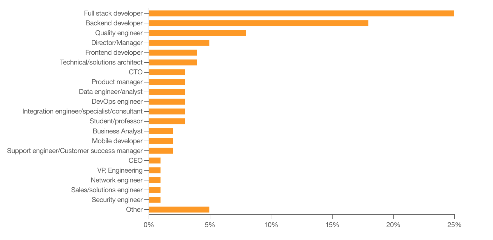
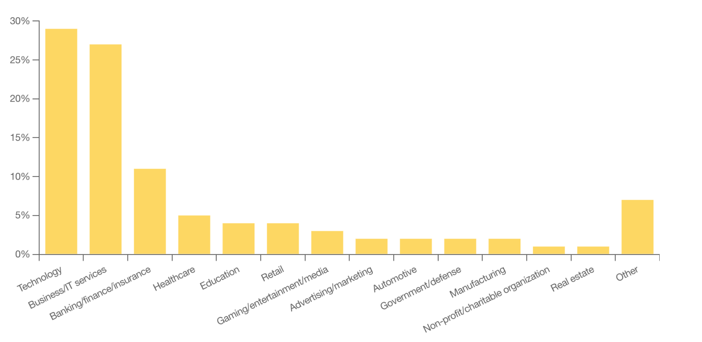
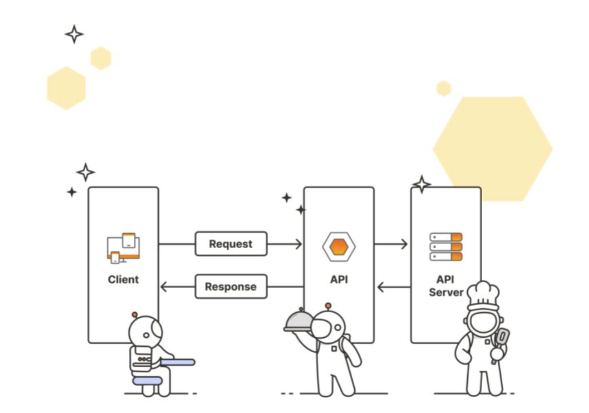
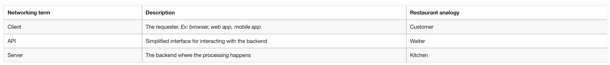

# What are APIs?

## Application Programming Interfaces
- Application Programming Interfaces (API) là 1 hợp đồng cho phép code này giao tiếp với code kia. APIs là nền tảng của phần mềm hiện tại vì nó cho phép share resources và services trên các ứng dụng, tổ chức và thiết bị.
- Bạn đã từng thanh toán trên website? Check thời tiết trên điện thoại? Nghe Spotify trên cả máy tính và điện thoại? Sử dụng GG maps trong 1 app khác? Dù bạn có biết hay không thì bạn vẫn đang sử dụng API hàng ngày.

### Why are APIs important?
1. API giúp các developer tích hợp các tính năng hấp dẫn và tự động hóa quy trình mà không cần phải xây dựng lại từ đầu.
Ví dụ: Sử dụng API Thời tiết thay vì tự triển khai hệ thống đo lường thời tiết bằng cách thả bóng khí tượng.

2. API cho phép các doanh nghiệp mở rộng sản phẩm để thúc đẩy đổi mới nhanh chóng.
Ví dụ: Các ứng dụng có thể sử dụng API của Twitter hoặc Meta để thực hiện các thao tác như đăng bài thay người dùng hoặc thu thập dữ liệu từ các bài đăng (tweets)

3. API có thể trở thành sản phẩm độc lập.
Ví dụ: Các giải pháp SaaS (Software as a Service) như API thanh toán của Stripe hoặc API nhắn tin và email của Twilio.

### Who works with APIs
- APIs không chỉ dành cho developers. Theo Postman's latest State of the API Report, gần như 1 nửa số lượng phản hồi trong khảo sát giữ những vị trí non-developer, ví dụ như management, solution architects, business and data analyst, educators và researchers.

- Việc sử dụng API không chỉ giới hạn ở các ngành công nghệ và CNTT. Các phản hồi khảo sát trong cùng báo cáo cho thấy rằng trong khi các ngành công nghệ, kinh doanh, CNTT và ngân hàng chiếm phần lớn việc sử dụng API, bất kỳ ngành nào cũng có thể hưởng lợi từ sự tiện lợi mà API mang lại.

### Who benefits from APIs?
Cuối cùng, mọi người đều được hưởng lợi từ API trực tiếp hoặc gián tiếp vì API giúp các quy trình hiệu quả hơn và kết nối các dịch vụ mà chúng ta yêu thích và tin tưởng. 

## APIs - A Digital Restaurant
- Bạn hãy tưởng tượng APIs giống như người bồi bàn trong 1 nhà hàng, đóng vai trò trung gian giữa khách hàng và nhà bếp.

- Khách hàng muốn món soup không cần phải đi vào trong bếp để nấu. Họ thậm chí còn không cần biết món soup được nấu như nào! Họ chỉ cần biết làm thế nào để order người bồi bàn về món soup, mong muốn người bồi bàn đó mang món soup cho họ.
- API hoạt động theo cùng một cách, nhưng có tên gọi khác nhau cho những người tham gia. Thay vì súp, người yêu cầu có thể yêu cầu dữ liệu hoặc thực hiện một dịch vụ.

## Types of APIs
### Medium
API có thể apply cho nhiều giao diện khác nhau

#### Hardware APIs
- Giao diện để phần mềm giao tiếp với phần cứng.
- Ex: Camera trên điện thoại giao tiếp với hệ điều hành như nào?

#### Software Library APIs
- Giao diện sử dụng trực tiếp sử dụng code từ base code khác.
- Ex: Sử dụng các phương thức từ thư viện mà bạn muốn nhập vào ứng dụng của mình.

#### Web APIs
- Giao diện để giao tiếp giữa các base code trên network.

Nhiều loại APIs có thể sử dụng cho 1 task. Ví dụ, uploading a photo trong Instagram sử dụng nhiều APIs khác nhau:
1. Hardware API để app giao tiếp với camera.
2. Software library API để ảnh process với filters.
3. Web API để gửi ảnh của bạn cho server của Instagram sau đó bạn bè của bạn có thể tim nó.

### Architectures
Có nhiều cách để xây dựng và sử dụng API. Một số loại kiến ​​trúc bạn có thể gặp là:
- REST (Representational State Transfer)
- GraphQL
- WebSockets
- webhooks
- SOAP (Simple Object Access Protocol)
- gRPC (Google Remote Procedure Call)
- MQTT (MQ Telemetry Transport)

### Access
APIs cũng khác nhau về phạm vi đối tượng có thể truy cập.

#### Public APIs (aka Open APIs)
- Được sử dụng bởi bất kì ai khám phá API.

#### Private APIs
- Được sử dụng trong 1 tổ chức và không được công khai.

#### Partner APIs
- Được sử dụng giữa một hoặc nhiều tổ chức đã có mối quan hệ với nhau.

