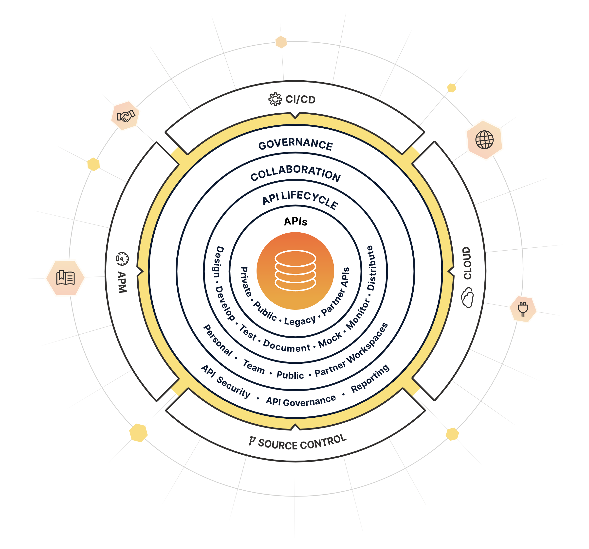
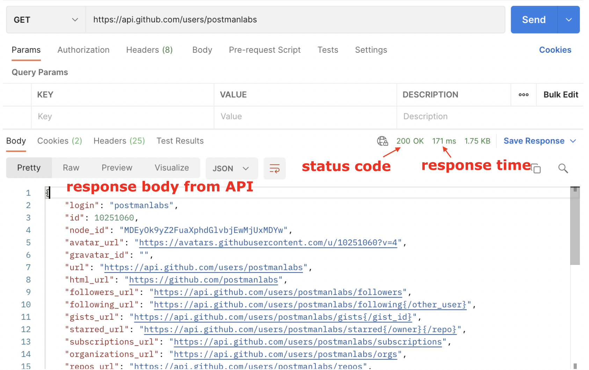

# Introducing Postman

## An API Platform
- Postman là một nền tảng API để xây dựng và sử dụng API. Postman đơn giản hóa từng bước của vòng đời API và hợp lý hóa sự cộng tác để bạn có thể tạo ra các API tốt hơn nhanh hơn và sử dụng chúng dễ dàng.

## Working with APIs
- Đây là cùng một call được thực hiện với Postman. Postman hiển thị phản hồi với các thụt lề và màu sắc rõ ràng và cho phép bạn lưu, sắp xếp và chia sẻ các yêu cầu của mình.
- Bạn cũng có thể xem tất cả các thành phần của yêu cầu và phản hồi được chia thành các tab và các chi tiết hữu ích khác như thời gian phản hồi và mã trạng thái.

