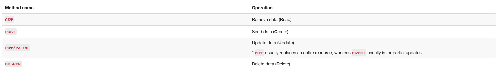
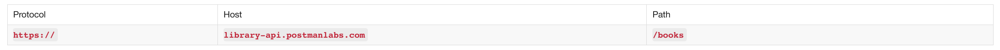
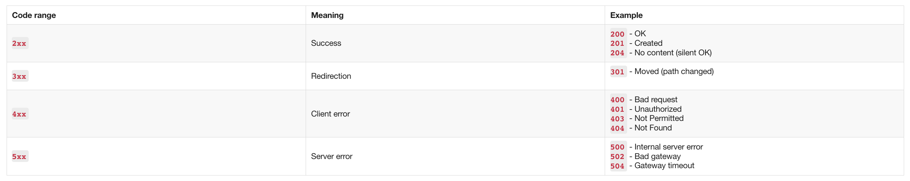
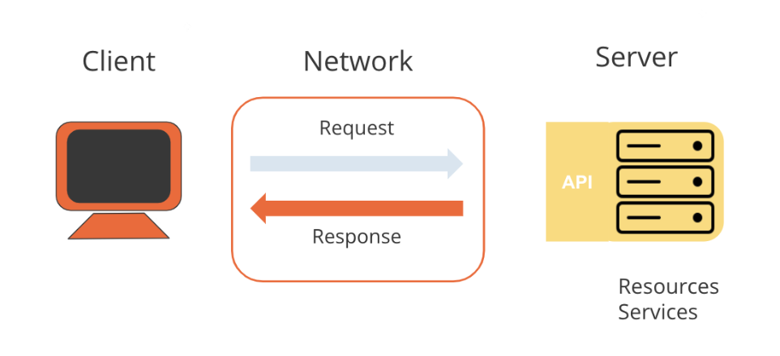

# API Request

## Request methods
- Khi chúng ta thực hiện lệnh call HTTP đến server, chúng ta chỉ định phương thức yêu cầu cho biết loại hoạt động mà chúng ta sắp thực hiện. Chúng cũng được gọi là HTTP verbs.
- Một số request methods HTTP phổ biến:

## Request URL
- Ngoài request method, request phải bao gồm URL yêu cầu chỉ ra nơi thực hiện lệnh call API. Request URL có ba phần: giao thức (như http:// hoặc https://), máy chủ (vị trí của máy chủ), và **path** (tuyến đường trên máy chủ). Trong REST API, đường dẫn thường trỏ đến một thực thể tham chiếu, như "books".

## Response status codes

## Request-Response pattern
- API là giao diện cho phép chúng ta biết loại response nào sẽ nhận được khi thực hiện một số lệnh call nhất định đến máy chủ.
- Bạn tạo 1 HTTP GET request tới https://library-api.postmanlabs.com/books và nhận được 1 response từ server.

- Client là tác nhân đưa ra request. Ví dụ, client có thể là browser hoặc app bạn đã mã hóa.
- Server sẽ diễn giải yêu cầu (GET /books) và gửi response thích hợp qua netwoerk trở lại client Postman: danh sách sách.

## Request Parameters

### Query parameter syntax

