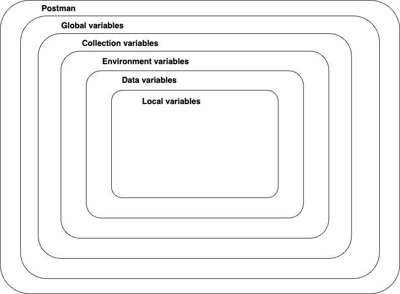

# Variables and Scripting
## Variable scopes


## Scripting in Postman
- Postman cho phép bạn thêm automatically và hành vi động vào collecton của mình bằng script. 
- Postman sẽ tự động excute bất kỳ script nào được cung cấp trong hai event trong luồng requests:

1. Ngay trước khi request được gửi: script trước yêu cầu (Pre-request Script of Scripts tab). 
2. Ngay sau khi phản hồi trả về: tập lệnh sau phản hồi (Post-response of Scripts tab).

## The pm object
- Postman có một đối tượng trợ giúp có tên là pm giúp bạn truy cập dữ liệu về môi trường Postman, requests, responses, variables và testing utilities.
- Ví dụ: bạn có thể truy cập nội dung phản hồi JSON từ API bằng:
```
pm.response.json()
```

- Bạn cũng có thể lập trình để lấy các biến collection như giá trị của baseUrl bằng cách:
```
pm.collectionVariables.get(“baseUrl”)
```

- Ngoài việc lấy các biến, bạn cũng có thể thiết lập chúng bằng lệnh `pm.collectionVariables.set("variableName", "variableValue")` như thế này:
```
pm.collectionVariables.set(“myVar”, “foo”)
```

### Setting and getting collection variables
- Object pm cho phép bạn thiết lập và lấy các biến bộ sưu tập.
- Để thiết lập collection variable, hãy sử dụng phương thức `.set()` với hai tham số: tên biến và giá trị biến.
```
pm.collectionVariables.set("variableName", value)
```
- Để lấy một collection variable, hãy sử dụng phương thức `.get()` và chỉ định tên biến bạn muốn lấy:
```
pm.collectionVariables.get("variableName")
```

