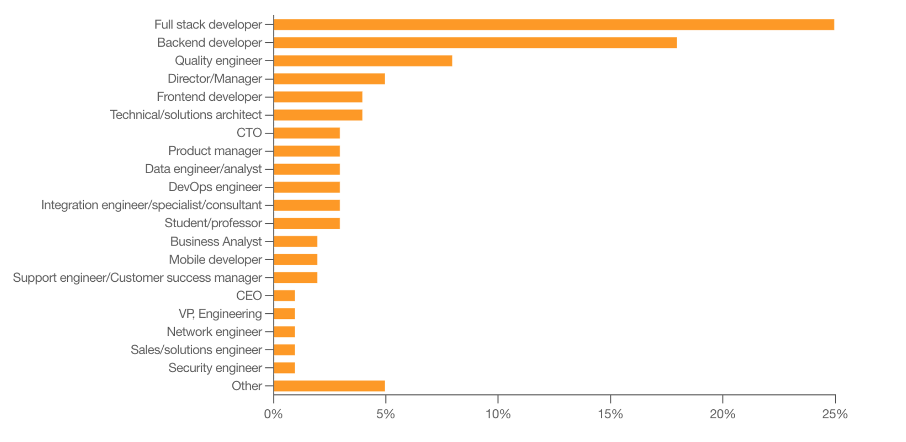
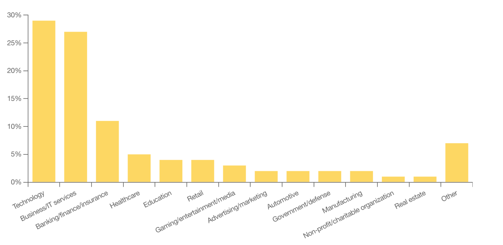

# What are APIs?

## Application Programming Interfaces
- Application Programming Interfaces (API) là 1 hợp đồng cho phép code này giao tiếp với code kia. APIs là nền tảng của phần mềm hiện tại vì nó cho phép share resources và services trên các ứng dụng, tổ chức và thiết bị.
- Bạn đã từng thanh toán trên website? Check thời tiết trên điện thoại? Nghe Spotify trên cả máy tính và điện thoại? Sử dụng GG maps trong 1 app khác? Dù bạn có biết hay không thì bạn vẫn đang sử dụng API hàng ngày.

## Why are APIs important?
1. API giúp các developer tích hợp các tính năng hấp dẫn và tự động hóa quy trình mà không cần phải xây dựng lại từ đầu.
Ví dụ: Sử dụng API Thời tiết thay vì tự triển khai hệ thống đo lường thời tiết bằng cách thả bóng khí tượng.

2. API cho phép các doanh nghiệp mở rộng sản phẩm để thúc đẩy đổi mới nhanh chóng.
Ví dụ: Các ứng dụng có thể sử dụng API của Twitter hoặc Meta để thực hiện các thao tác như đăng bài thay người dùng hoặc thu thập dữ liệu từ các bài đăng (tweets)

3. API có thể trở thành sản phẩm độc lập.
Ví dụ: Các giải pháp SaaS (Software as a Service) như API thanh toán của Stripe hoặc API nhắn tin và email của Twilio.

## Who works with APIs
- APIs không chỉ dành cho developers. Theo Postman's latest State of the API Report, gần như 1 nửa số lượng phản hồi trong khảo sát giữ những vị trí non-developer, ví dụ như management, solution architects, business and data analyst, educators và researchers.

- Việc sử dụng API không chỉ giới hạn ở các ngành công nghệ và CNTT. Các phản hồi khảo sát trong cùng báo cáo cho thấy rằng trong khi các ngành công nghệ, kinh doanh, CNTT và ngân hàng chiếm phần lớn việc sử dụng API, bất kỳ ngành nào cũng có thể hưởng lợi từ sự tiện lợi mà API mang lại.

## Who benefits from APIs?
Cuối cùng, mọi người đều được hưởng lợi từ API trực tiếp hoặc gián tiếp vì API giúp các quy trình hiệu quả hơn và kết nối các dịch vụ mà chúng ta yêu thích và tin tưởng. 